# Deployment

[TOC]

# Note

1. You will need to deploy your frontend to Vercel, backend is optional and you will gain bonus marks if you successfully modified backend and deployed it.

2. There are several steps, please patiently go through each of them.

# Background

## Rationale

Deploy deploy deploy 🚀! While having our _Bigbrain_ working locally is fun and all, there's no point if you can't show it off to everyone else 😎!

## Context

Normally, we have to run both our frontend & backend on terminal. Vercel however, can handle them for us! All we need to do is to configure our HTTP requests in frontend to go to our `deployed URL`, instead of our `localhost URL`.

## Getting Started

- Make sure you are in Bigbrain repository.

# Task

An image guide is available for some of the instructions below. You can toggle their visibility by clicking on the respective text - for example:

<details close>
<summary>Click this line of text to toggle image visibility</summary>

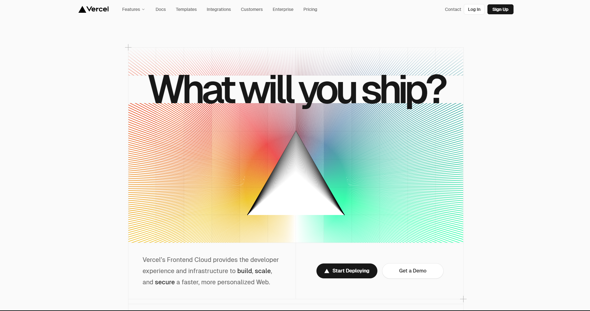

</details>

Make sure to also read the tips given by Vercel as you progress. **Don't just blindly follow the instructions given**, as there will be inputs that you will need to modify accordingly for your needs.

## 0. Create Accounts

1. **A private github account:** Vercel requires you to link your repositories to deploy. If you do not currently have an account, you should create one by following the link: https://github.com/signup

2. **A Vercel account:** Vercel offers us a serverless method to deploy our backend repository. The setup is completely free and does not require any payment methods for sign-up. Create an account and select **Continue with GitHub** so that your accounts can be linked: https://vercel.com/signup.

Why do all of this?

<details close>
<summary>Visual explanation of what we're trying to do</summary>
We're attempting to link our code to Vercel. To do this, we will be using a Github account as an intermediary.

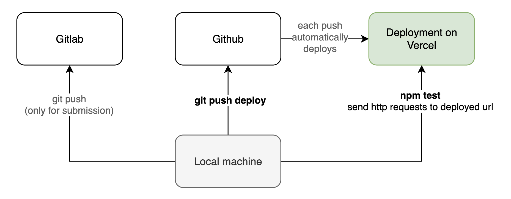

</details>

## 1. Duplicate your repository to GitHub

1. In a separate window, log in to your GitHub account and select **New repository**.
   <details close>
   <summary>Top Left > Dropdown > New Repository</summary>

   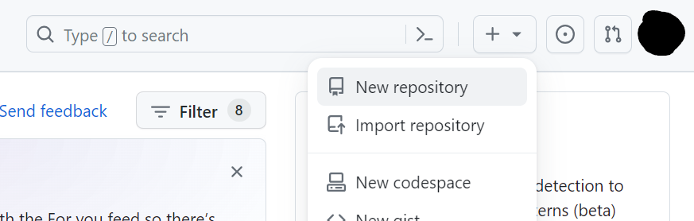

   </details>

2. Name your repository, e.g. "`bigbrain-deploy`", and make sure to select **Private**. Then hit **Create Repository**.
   <details close>
   <summary>Create Repository Form - example details</summary>

   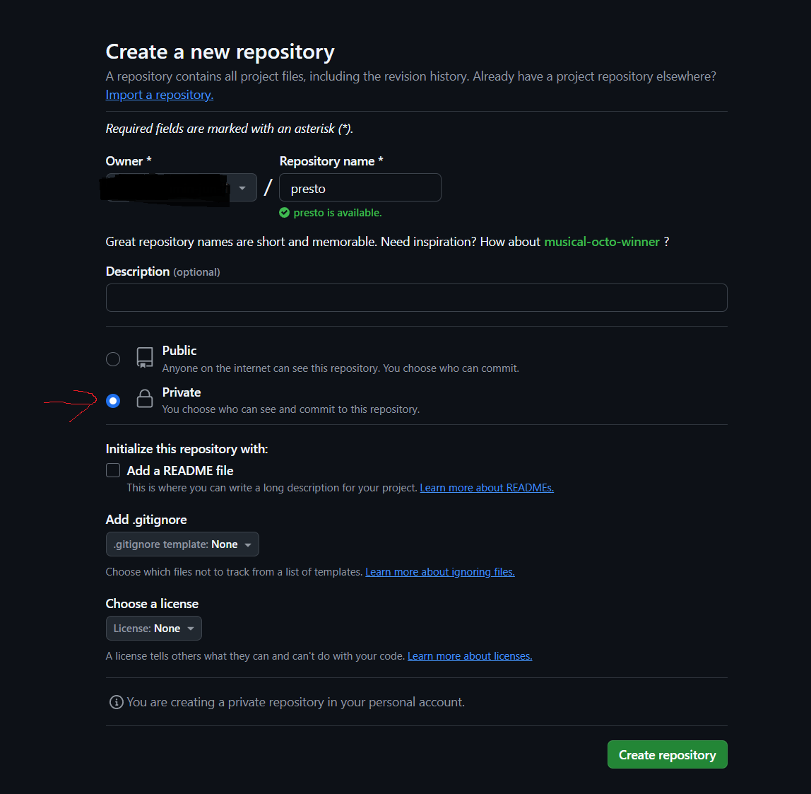

   </details>

3. Just in case you missed it, please ensure the Github repo is **private**.
4. You should be automatically navigated to your created repository. Back on your terminal, use the following code to update your GitHub repository.

```
# Replace <SSH_URL> with your Github repository's SSH URL.
# The SSH URL can be found in the empty Github repo you just created.
# E.g. git@github.com:USERNAME/bigbrain-deploy.git
$ git remote add deploy <SSH_URL>
$ git push deploy
```

After running the command, your GitHub repository should then be populated with the code from your backend.

**NOTE**: **Whenever you want to update your Github repository (hence Vercel as well)**, run `git push deploy` after changes have been added and committed. If you only run `git push` this will send your changes to Gitlab, not Github.

Getting a "`git@github.com: Permission denied (publickey)` or similar access rights error? You'll need to add your SSH-Key to Github! Just like we did for Gitlab in [`git-intro`](https://nw-syd-gitlab.cseunsw.tech/COMP6080/25T1/students/z1234567/git-intro). See instructions below, and then attempt to push again.

- Generate a new SSH Key (optional): https://docs.github.com/en/authentication/connecting-to-github-with-ssh/generating-a-new-ssh-key-and-adding-it-to-the-ssh-agent
- Add SSH key to Github: https://docs.github.com/en/authentication/connecting-to-github-with-ssh/adding-a-new-ssh-key-to-your-github-account

## 2. Deploy Frontend using Vercel

_[Vercel](https://en.wikipedia.org/wiki/Vercel) is a cloud platform as a service company. Vercel architecture is built around [composability](https://en.wikipedia.org/wiki/Composability)._

1. Add and commit all changes and push them up to the repository:
   ```shell
   $ git push deploy
   ```
   If you forget to add, commit and push deploy, you may get `404 not_found` errors later on.
2. On the Vercel homepage, log into Vercel and then select the `Add New...` button and `Project` selection.
   <details close>
   <summary>Top Left > Add New > Dropdown > Project </summary>

   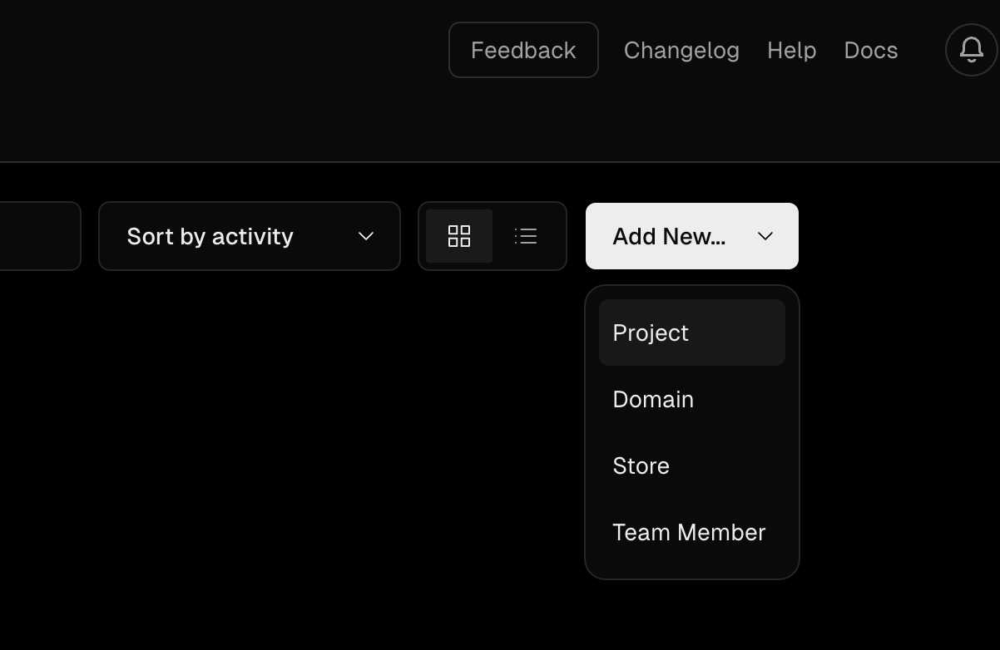

   </details>

3. Select `Import` on the repository that you created in GitHub.
   <details close>
   <summary>Select Github as the Provider</summary>

   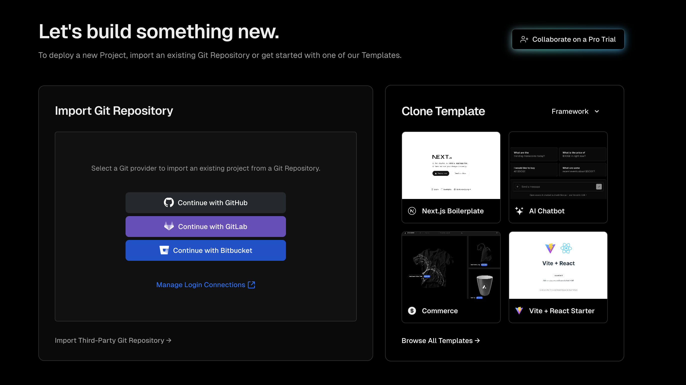

   </details>
   <details close>
   <summary>Import Git Repository > Import </summary>

   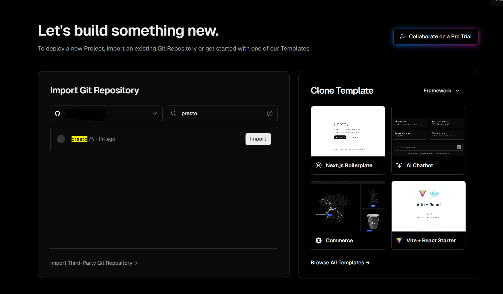

   </details>

   Can't see your github repo? Follow the `Adjust GitHub App Permissions →` link and instructions.

4. Select `Deploy` to deploy your repository and wait shortly for your repository to be built. Make sure to choose the correct directory for deployment, e.g. `backend` or `frontend`, alternatively you can create separate github repository for frontend and backend.
   <details close>
   <summary> Configure Project > Deploy </summary>

   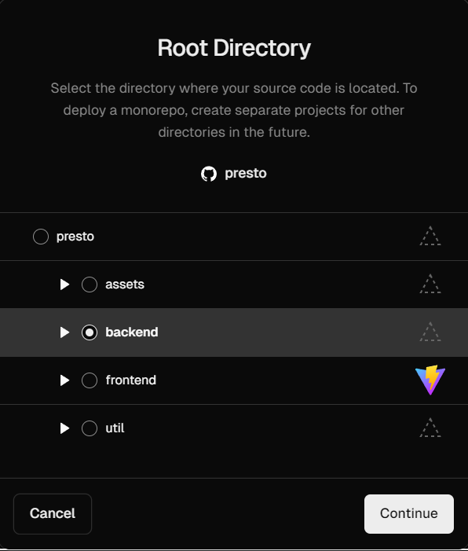

   </details>

   If successful, you should see a "Congratulations" and on your `Dashboard` see your deployment with a green "Ready" Status.

   First, click on `Inspect Deployment` at the bottom of the page. You should end up on the `Deployment Details` page.
   If the build log mentions `npm ERR! code 1` go back to your project and click on the `Settings` tab. Then scroll down and change the Node version to 16. Afterwards, go back to the `Deployments` tab and click on the ellipsis button of your latest deployment. Then click `Redeploy`.

7. Make your deployed url contain your zID. Go to `Project Settings` > `Domains` > `Edit`, and modify your domain name to include your zID, e.g. `z1234444-bigbrain-fe-deploy.vercel.app`.
   <details close>
   <summary> Homepage > Project Menu > Settings </summary>

   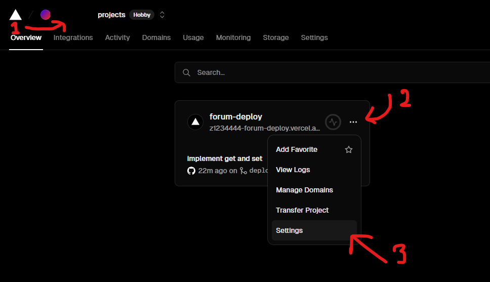

   </details>
   <details close>
   <summary> Project Settings > Domain > Edit </summary>

   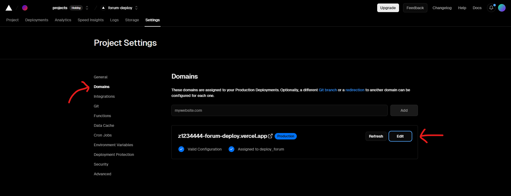

   </details>

8. Congratulations! You've now deployed your frontend onto the web...somewhat. If you navigate to your deployed url, you should see your frontend in action!

   However, as soon as you try to make api calls to backend, you'll start running into server errors. This is fine as backend deployment is optional and you will gain bonus marks if you successfully modified backend and deployed it.

## 5. Deploy your backend

Unlike the frontend, it could be hard to configure backend deployment. You will need to figure out how to use Vercel with Upstash for `key-value` storage and modify how backend handles database operations to use Upstash. It may also be necessary for you to add a `vercel.json` file to the backend repository to configure the deployment.

You may find these resources helpful:
- [Vercel Upstash Redis Integration](https://upstash.com/docs/redis/howto/vercelintegration#vercel-upstash-redis-integration)
- [Upstash with Express.js](https://upstash.com/docs/workflow/quickstarts/express#express-js)
- [Deploy express.js to vercel](https://vercel.com/guides/using-express-with-vercel)

## Testing and Submitting your DEPLOYED_URL

1. Open [progress.csv](./progress.csv) and modify the `FE_DEPLOYED_URL` to your newly deployed site, e.g. https://z1234444-anything-you-want.vercel.app.

   **A reminder that the `FE_DEPLOYED_URL` must contain your zID exactly once.** You may need to go to Settings > Domains > and edit your deployed url to include your zID.
2. You don't need to add `BE_DEPLOYED_URL` in `progress.csv` but you need to connect your deployed frontend with your deployed backend if you have deployed backend.

## Common Issues

  <details close>
  <summary> 1. Vercel is not deploying the code you expect </summary>

- Remember to `git add`, `git commit` and `git push deploy`. This will ensure that Github and hence Vercel receive your updated code.
- After you've pushed your code to GitHub, ensure the commit hash on GitHub matches the one on Vercel.
  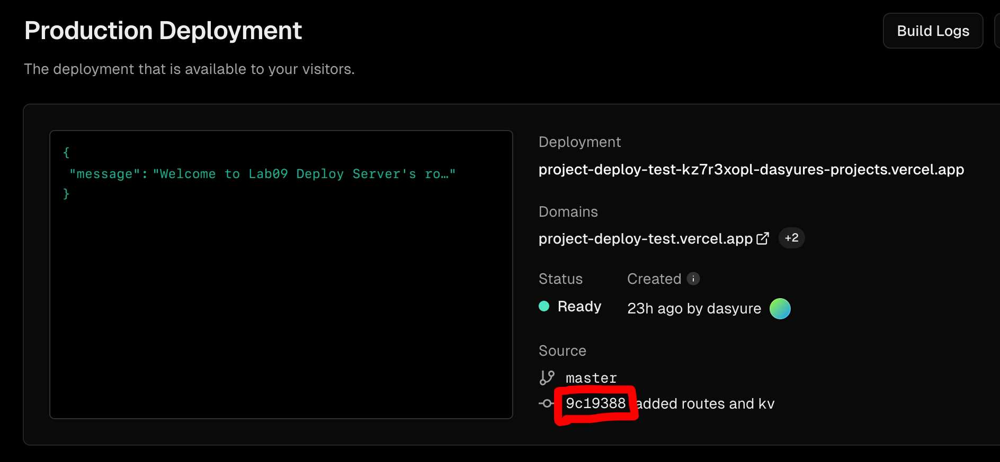
  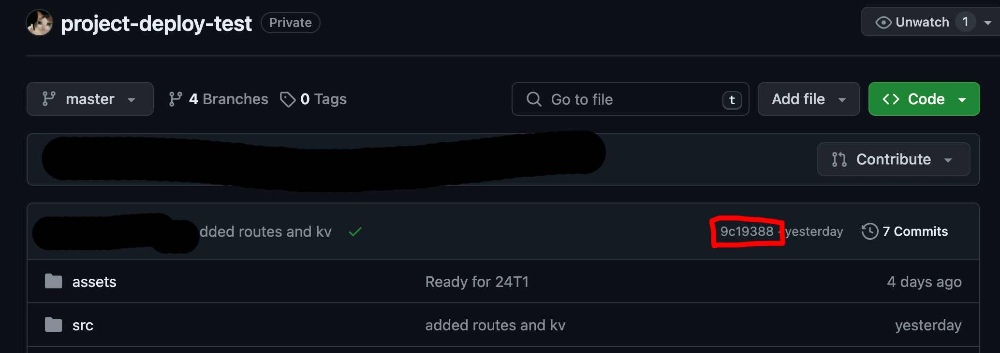
  

- You can also check if Vercel has the correct files, by clicking on Your project > Source. Ensure that each file is as expected. Check for example if the `DEPLOYED_URL` was updated.
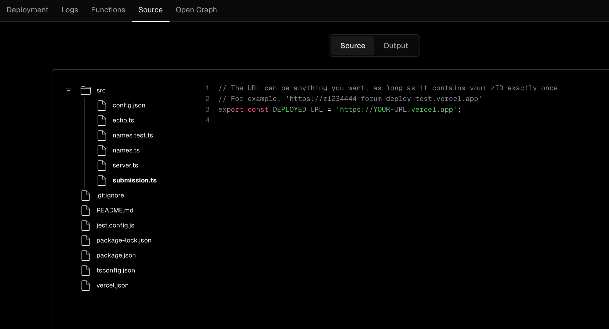
</details>

  <details close>
  <summary> 2. Incorrect format for deployed URL </summary>

- Ensure the URL begins with `http` or `https`. Also check that it **doesn't** end with `/`.
</details>

  <details close>
  <summary> 3. You've changed branches at some point </summary>

- Go to Settings > Git. Scroll down to Production Branch and change the name of the branch.
- Additionally if you go to the Deployments tab, you may see that it says Preview, like in the image below. For the latest deployment, click on the ellipse icon (three horizontal dots) on the very right and click 'Promote to production'.
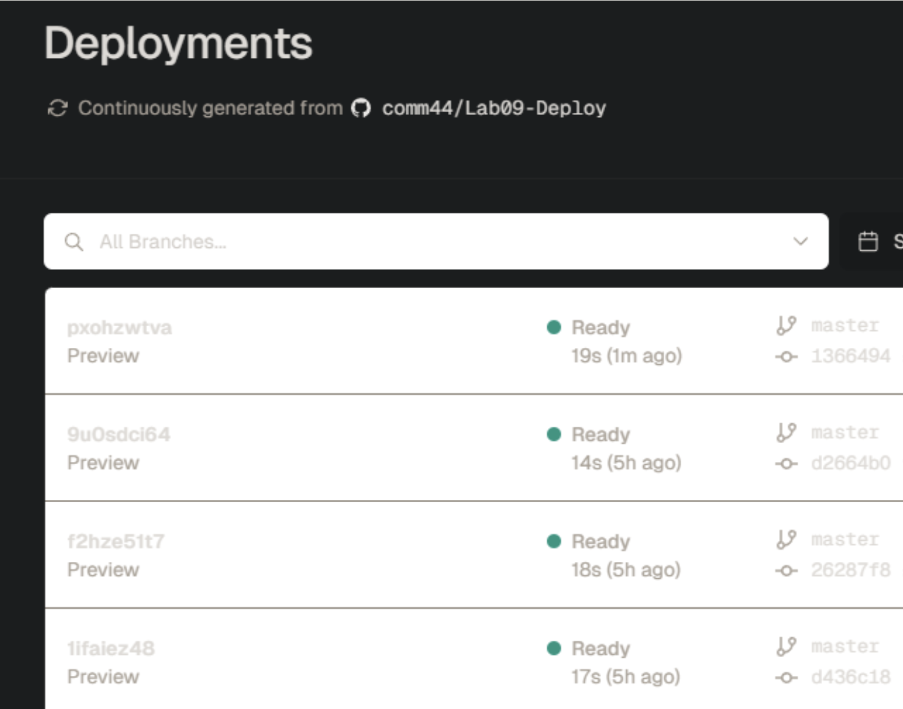
</details>


## Debugging tips

  <summary> 1. Check the logs </summary>

- Your project > Deployment > Click on the latest deployment > Log
- Instead of having `console.log` output to a terminal, it gets output here.
- Any `console.log` statements in your server or function implementations, will also show here.
  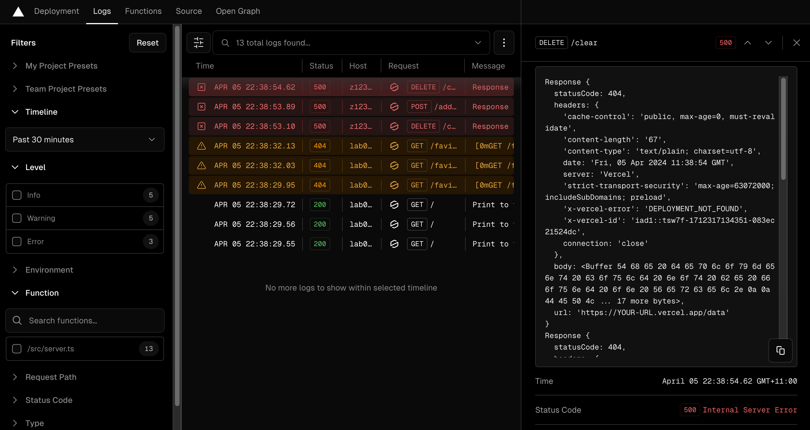
  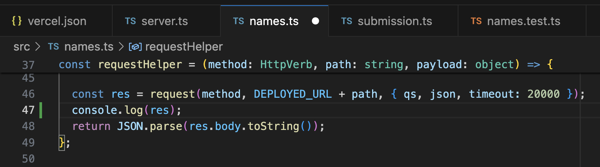

  </details>

  <details close>
  <summary> 2. General tips & Additional resources </summary>

- Debugging can require running `git push deploy` frequently. Whenever that occurs, it will redeploy your project. Keep in mind that Vercel only allows 100 deployments a day.
- If deployment is failing during setup, read the error message by going to Your project > Deployment > Click on the latest deployment > Read the deployment details.
- [Vercel Error Codes](https://vercel.com/docs/errors)
- [Upstash RESTful API](https://upstash.com/docs/devops/developer-api/redis)
</details>

# Submission

- Use `git` to `add`, `commit`, and `push` your changes on your master branch. This time, you don't use `git push deploy` as that only updates Vercel and Github, not Gitlab. Your GitLab pipeline should also pass.
- Check that your code has been uploaded to your Gitlab repository on this website (you may need to refresh the page).

**If you have pushed your latest changes to master on Gitlab no further action is required! At the due date and time, we automatically collect your work from what's on your master branch on Gitlab.**
